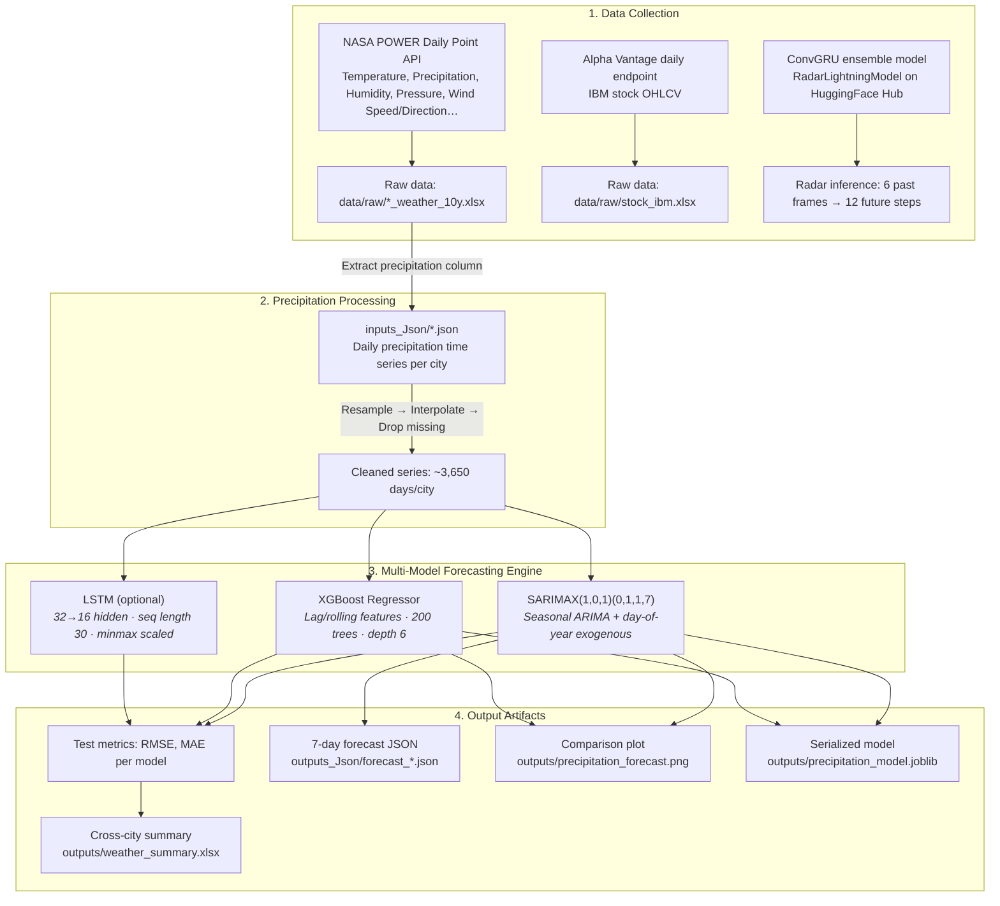
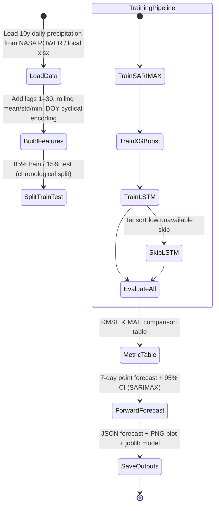

# 🌧️ THETA — Multi-Model Precipitation Forecasting & Global Weather Data Collection

A modular Python framework for **multi-city weather data collection**, **precipitation time-series forecasting**, and **radar lightning nowcasting**. Supports SARIMAX, XGBoost, LSTM, and ConvGRU ensemble models, processing over a decade of global meteorological station data and NASA POWER reanalysis.

---

## 🏛️ System Architecture & Workflow



---

## 🧭 Forecasting Pipeline



---

## 🏆 Model Benchmarks (Jakarta · 10-Year Precipitation)

Offline evaluation on the last 15% of daily data:

| Rank | Model Architecture | RMSE (mm) | MAE (mm) | Notes |
| :---: | :--- | :---: | :---: | :--- |
| 🥇 **1** | **XGBoost Regressor** | **96.52** | **14.13** | Lag/rolling features · 200 trees |
| 🥈 **2** | **SARIMAX(1,0,1)(0,1,1,7)** | 96.89 | 15.05 | Seasonal diff · DOY exogenous · 95% CI |
| 🥉 **3** | **LSTM** (when available) | — | — | Requires tensorflow; skipped automatically if unavailable |

> **Note:** RMSE is in raw mm units. Jakarta's monsoon distribution has a heavy right tail, so absolute errors are high; MAE is a more intuitive daily-scale metric.

### Sample 7-Day Forecast (Jakarta, Indonesia)

| Date | SARIMAX (mm) | SARIMAX 95% CI | XGBoost (mm) |
| :---: | :---: | :---: | :---: |
| 2026-08-20 | 8.29 | [-7.08, 23.66] | 0.32 |
| 2026-08-21 | 8.03 | [-7.84, 23.91] | 0.13 |
| 2026-08-22 | 8.33 | [-7.93, 24.58] | 0.19 |
| 2026-08-23 | 8.62 | [-7.93, 25.17] | 3.87 |
| 2026-08-24 | 7.96 | [-8.82, 24.75] | 4.21 |
| 2026-08-25 | 7.44 | [-9.53, 24.40] | 4.51 |
| 2026-08-26 | 7.20 | [-9.91, 24.30] | 4.48 |

---

## 📊 Supported Cities & Weather Parameters

### Weather Data Collection (`weather.py`)

Collects **14 meteorological parameters** from the NASA POWER Daily Point API:

| Parameter | Code | Unit |
| :--- | :--- | :--- |
| Precipitation | PRECTOTCORR | mm |
| Temperature (2m) | T2M | °C |
| Max / Min Temperature | T2M_MAX / T2M_MIN | °C |
| Relative Humidity | RH2M | % |
| Pressure | PS | kPa |
| Wind Speed / Direction | WS10M / WD10M | m/s, ° |
| Max / Min Wind Speed | WS10M_MAX / WS10M_MIN | m/s |
| Specific Humidity | QV2M | g/kg |
| Surface Temperature | TS | °C |
| All-Sky SW Radiation | ALLSKY_SFC_SW_DWN | W/m² |
| Clear-Sky SW Radiation | CLRSKY_SFC_SW_DWN | W/m² |

**Built-in city directory** (Nominatim geocoding fallback for any city):

| City | Latitude | Longitude |
| :--- | :---: | :---: |
| Jakarta, Indonesia | -6.21 | 106.85 |
| Beijing, China | 39.90 | 116.41 |
| Shanghai, China | 31.23 | 121.47 |
| New York, USA | 40.71 | -74.01 |
| London, UK | 51.51 | -0.13 |
| Sydney, Australia | -33.87 | 151.21 |
| Cairo, Egypt | 30.04 | 31.24 |
| Mumbai, India | 19.08 | 72.88 |

### Stock Data (`stocks.py`)

Fetches IBM daily OHLCV data via Alpha Vantage TIME_SERIES_DAILY, exported as styled Excel.

### Radar Lightning Nowcasting (`models/irene.py`)

Loads `RadarLightningModel` (it4lia/irene) from HuggingFace Hub, runs ConvGRU ensemble inference: **6 past radar frames → 12 future steps**, 10 ensemble members.

---

## 📂 Project Structure

```text
THETA/
├── inputs_Json/                              # Daily precipitation JSON per city
│   └── Jakarta_Indonesia_precip.json         # 10y daily precip (from NASA POWER)
├── outputs/
│   ├── precipitation_forecast.png            # 2×2 model comparison plot
│   ├── precipitation_model.joblib            # Serialized SARIMAX + XGBoost models
│   └── weather_summary.xlsx                  # Cross-city weather statistics
├── outputs_Json/                             # Machine-readable forecast outputs
│   └── forecast_Jakarta,_Indonesia.json      # 7-day SARIMAX + XGBoost forecast
├── weather.py                                # Weather data collection entrypoint
├── stocks.py                                 # Stock data collection entrypoint
├── precipitation_forecast.py                 # Precipitation forecasting entrypoint
├── requirements.txt
└── README.md
```

---

## 🚀 Quick Start

### 1. Install dependencies

```bash
cd THETA
python -m venv .venv
source .venv/bin/activate        # Windows: .venv\Scripts\activate
pip install -r requirements.txt
pip install tensorflow           # Optional; use --no-lstm to skip LSTM
```

### 2. Collect global weather data

```bash
python weather.py
# Interactive prompts: years? cities? (comma-separated, default: jakarta)
# Output: outputs/Jakarta_Indonesia_weather_10y.xlsx + inputs_Json/*.json

# Or skip interactively
printf '5\njakarta\n' | python weather.py
```

### 3. Run precipitation forecast

```bash
# Default: Jakarta, 10 years, SARIMAX + XGBoost
python precipitation_forecast.py

# From existing JSON (the pipeline way)
python precipitation_forecast.py --input inputs_Json/Jakarta_Indonesia_precip.json

# With custom years
python precipitation_forecast.py --years 5

# Skip LSTM (faster, no tensorflow needed)
python precipitation_forecast.py --no-lstm

# Custom output path
python precipitation_forecast.py --input inputs_Json/Jakarta_Indonesia_precip.json \
    --output outputs_Json/my_forecast.json
```

### 4. Radar lightning nowcasting

```python
from models.irene import RadarLightningModel

model = RadarLightningModel.from_pretrained("it4lia/irene")
import numpy as np
past = np.random.rand(6, 256, 256).astype(np.float32)  # 6 past radar frames
forecasts = model.predict(past, forecast_steps=12, ensemble_size=10)
# forecasts.shape = (10, 12, 256, 256)
```

### 5. Stock data (Alpha Vantage)

```bash
# Edit stocks.py to add your API key, then:
python stocks.py
# Output: outputs/stock_data.xlsx
```

---

## 🤖 LLM Orchestrator (`run_orchestrator.py`)

A natural-language forecasting frontend powered by [Nemotron-35](https://huggingface.co/nvidia/Nemotron-35). Parse any English request and get multi-model forecasts automatically.

### Configuration

| Env Var | Default | Description |
|---|---|---|
| `LLM_KEY` | `KEY_REMOVED` | API bearer token |
| `LLM_URL` | `http://10.7.1.21/` | OpenAI-compatible endpoint |
| `LLM_MODEL` | `nemotron-35` | Model name |
| `LLM_MAX_TOKENS` | `1024` | Max output tokens |

### CLI Usage

```bash
# Full pipeline: parse + forecast
python run_orchestrator.py --input "predict rainfall in Jakarta for the next 7 days"

# Dry-run: only show parsed intent (no forecasting)
python run_orchestrator.py --input "forecast AAPL stock price for the next 5 days" --dry-run

# Aliases
python run_orchestrator.py -i "how much rain will London get next week"
```

### What Gets Parsed

The LLM extracts these fields from your request:

| Field | Type | Example |
|---|---|---|
| `domain` | `"weather"` or `"stocks"` | `"weather"` |
| `target` | short phrase | `"rainfall"` |
| `location_or_symbol` | city / ticker | `"Jakarta"` |
| `horizon` | int (1–30) | `7` |
| `data_source_hint` | source tag | `"NASA_POWER"` |
| `note` | extra context | `"next week"` |

### Models Available

**Weather** (precipitation): SARIMAX · XGBoost · HistGradientBoosting · ETS · Random Forest · PatchTST · TimesFM · TabICL

**Stocks** (close price): SARIMAX · XGBoost · HistGradientBoosting · ETS · Random Forest

Missing dependencies (TensorFlow, transformers, histboost) are skipped gracefully.

### Outputs

Forecasts are saved as JSON in `outputs/orchestrator/`:

```json
{
  "city": "Jakarta",
  "forecast_dates": ["2025-01-24", "2025-01-25", "..."],
  "models": {
    "tabicl": {"predictions": [9.17, 10.80, ...], "metrics": {"model": "TabICL", "RMSE": 8.84, "MAE": 6.98}},
    "timesfm": {"predictions": [5.96, 7.02, ...], "metrics": {...}},
    "sarima": {"predictions": [...], "metrics": {...}}
  }
}
```

### Prompt Template

The orchestrator uses this system prompt (stored in `run_orchestrator.py`):

```
You are a forecasting orchestration agent. Parse the user request below
and output ONLY valid JSON — no explanation, no markdown, just the raw
JSON object. Required fields: domain, target, location_or_symbol,
horizon, data_source_hint, note.
```

Example interaction:

```
User: "predict rainfall in Jakarta for the next 7 days"
LLM → {"domain":"weather","target":"rainfall","location_or_symbol":"Jakarta",
       "horizon":7,"data_source_hint":"NASA_POWER","note":""}
→ Runs SARIMAX, XGBoost, RF, PatchTST, TimesFM, TabICL on Jakarta 10y data
→ Saves: outputs/orchestrator/forecast_Jakarta.json
```

---

## 📄 License & Credits

* **Weather data**: [NASA POWER](https://power.larc.nasa.gov) — Daily Point API (1981–present)
* **Stock data**: [Alpha Vantage](https://www.alphavantage.co) — TIME_SERIES_DAILY
* **Radar model**: [it4lia/irene](https://huggingface.co/it4lia/irene) — ConvGRU ensemble (HuggingFace Hub)
* **Tech stack**: statsmodels, XGBoost, TensorFlow/Keras, scikit-learn, pandas, matplotlib, joblib, openpyxl
